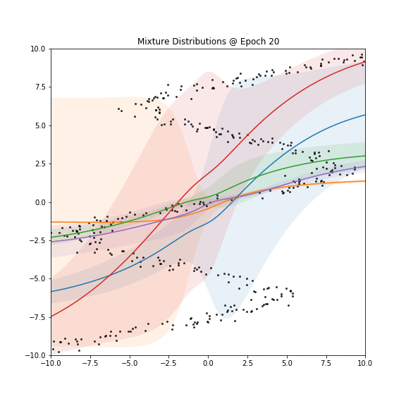

# Mixture Density Networks in pure keras

My writeup on exploring Mixture Density Networks in pure `keras`. [Link to notebook](main.ipynb) or run it locally: `git clone https://github.com/tnwei/pure-keras-mdn`

